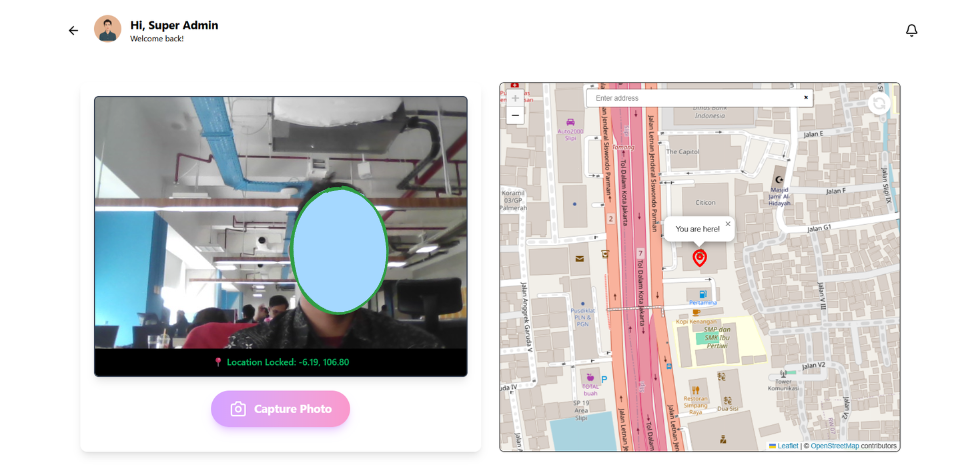
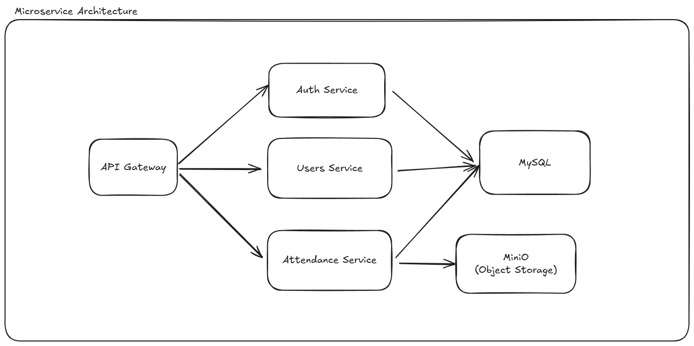

-----
-----
## WFH Employee Attendance Application

Hello! This is my submission for the Fullstack Web Technical Test from Dexa Group. This project is a comprehensive, full-stack web application designed to manage Work-From-Home (WFH) employee attendance.

**Live Application:**
`https://dexa-frontend.zeabur.app/`

**How to Access the Admin Dashboard:**
1.  **Obtain Credentials:** Please contact me directly to receive the login credentials for the admin account.
2.  **Log In & Navigate:** Once you have logged in as an admin, please append `/admin` to the URL in your browser's address bar to access the dashboard.
    * **Example:** `https://dexa-frontend.zeabur.app/admin`

The application is built based on the provided use case, featuring a backend with a **microservices architecture** using **NestJS** and a dynamic, responsive frontend using **React.js**. The goal was to create two primary interfaces: one for employees to log in and record their attendance , and another for HR administrators to manage employee data and monitor attendance records.

## ✨ Core Features

The application is split into two main roles, each with its own set of functionalities:

### For Employees

  * **Secure Authentication**: Employees can log in to access their dashboard.
  * **Clock-in & Clock-out**: Capture attendance with the exact date, time, and location coordinates.
  * **Photo Proof**: Upload a photo during clock-in as evidence of working from home, complete with geofencing so the attendance can't check in outside of the designated area.
  

### For HR Admins

  * **Employee Management**: A web-based interface to add new employees or update existing employee data.
  * **Attendance Monitoring**: View a comprehensive list of attendance records submitted by all employees.
  * **Role-Based Access**: Secure endpoints ensure that only authorized HR personnel can manage employee data.

-----

## 🛠️ Tech Stack & Architecture

This project is built as a monorepo to streamline development and deployment.

### Backend (`wfh-attendance-app`)

The backend follows a microservice pattern to ensure scalability and separation of concerns.

  * **Framework**: **NestJS** 
  * **Language**: **TypeScript** 
  * **`api-gateway`**: A single entry point that receives all client requests and routes them to the appropriate internal service.
  * **`auth-service`**: Handles user authentication, role validation, and JWT generation.
  * **`users-service`**: Manages all CRUD operations for employee data.
  * **`attendance-service`**: Manages all attendance-related logic, including clock-ins, clock-outs, and file uploads.
  * **Database**: **MySQL** with migrations handled by `db-migrate`.
  * **Object Storage**: **Minio** for storing uploaded attendance photos.
  * **Communication**: Services communicate over **TCP** for efficient, low-latency internal requests.

Below is the architecture of the microservices.

### Frontend (`employee-frontend`)

A modern, single-page application (SPA) providing a seamless user experience.

  * **Framework**: **React.js** (with Vite) 
  * **Language**: **TypeScript**
  * **Styling**: **Tailwind CSS** for a utility-first design approach.
  * **Routing**: `react-router-dom` for handling client-side navigation.
  * **State Management**: Component state and context for managing UI and data.

-----
